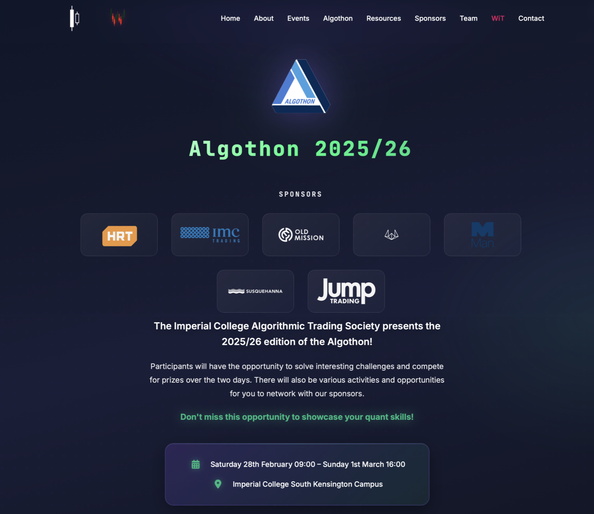
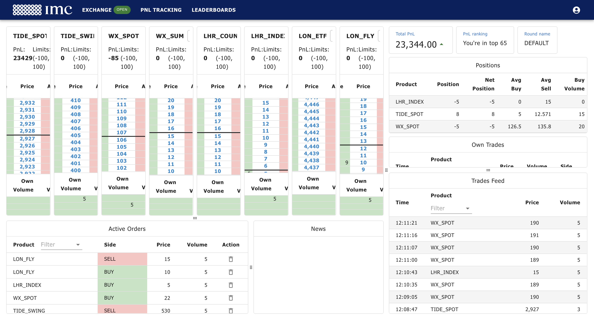
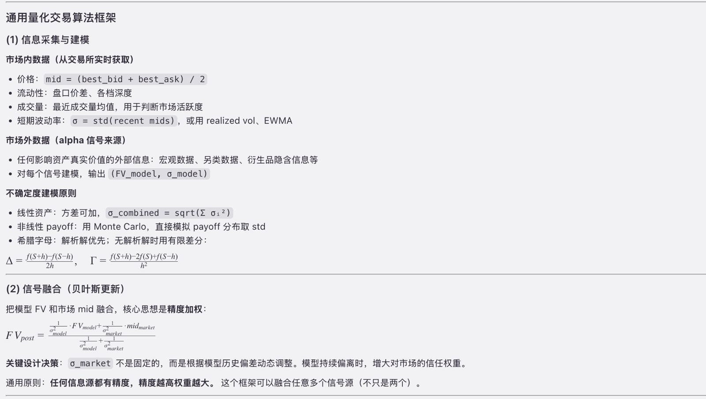
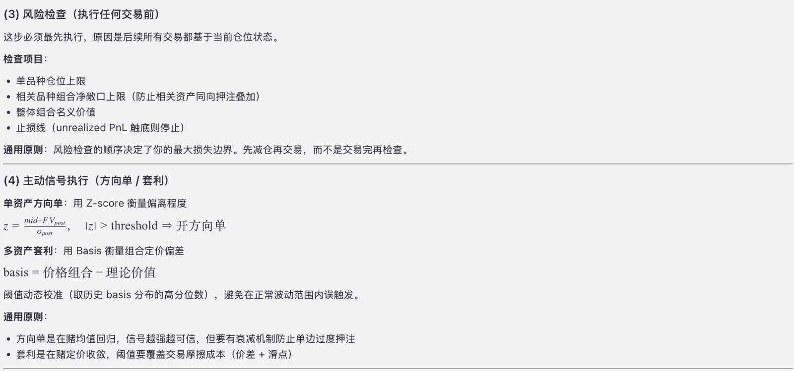
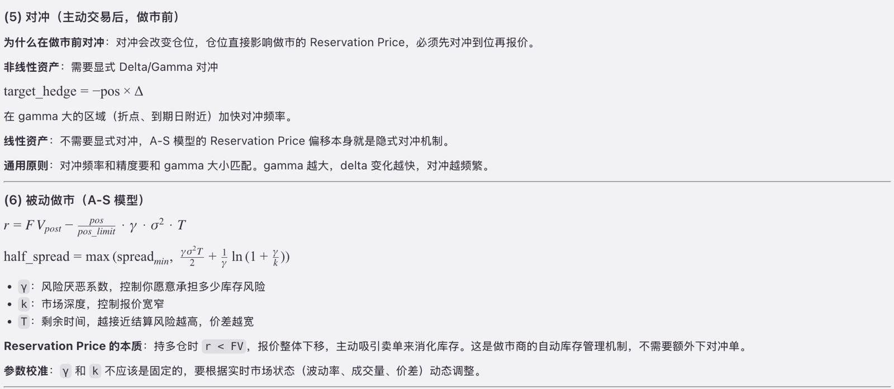

# 2026 Imperial Algothon

## Introduction

This is the project for the 2026 Imperial Algothon, held by Imperial Algorithmic Trading Society and IMC.

  
  

---

## Usage Guide

| File | Description |
|------|-------------|
| `example.ipynb` | Official documentation provided by IMC |
| `bot_template.py` | Official base bot framework provided by IMC |
| `algothon.ipynb` | Trading bot written by me |
| `verify_logic.py` | Test suite verifying the core logic of the bot |

---

## Summary

During the competition, the bot achieved a top 30% performance across all test runs.

After the competition, I revisited the strategy and rebuilt a more comprehensive quantitative trading system. See the images below for details.

  

  

  

